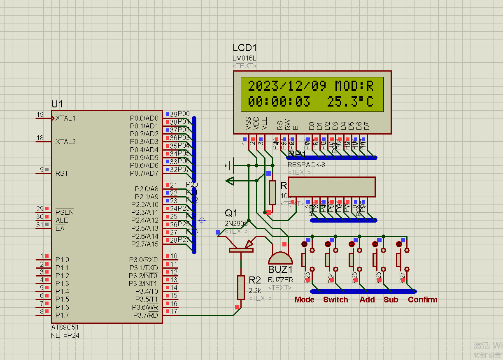

# 📢 **Electronic Clock**

The new **Electronic Clock** is designed with versatile features to enhance your experience. Below are its main functionalities:

---

## 1️⃣ **Display and Adjust Date & Time**  
- The clock can display **year, month, day, hour, minute, and second** with precision.  
- Easily adjust these settings using intuitive controls for accurate timekeeping.

---

## 2️⃣ **Temperature Display**  
- Real-time display of the **current temperature** in Celsius.  
- Ensure you stay informed about the ambient conditions.

---

## 3️⃣ **Alarm Clock Functionality**  
- Set an **alarm** for a specific date and time.  
- Perfect for reminders, special occasions, or daily wake-ups.

---

## 4️⃣ **Hourly Chime**  
- Enjoy an **hourly chime** to keep track of time throughout the day.  
- Audible notifications ensure you never miss the top of the hour.

---

### 🌟 **Compact, Functional, and Reliable**
With its efficient design and easy-to-use interface, the Electronic Clock is your ideal companion for time and temperature management.  

⏰ **Start your journey to precision timing today!**
